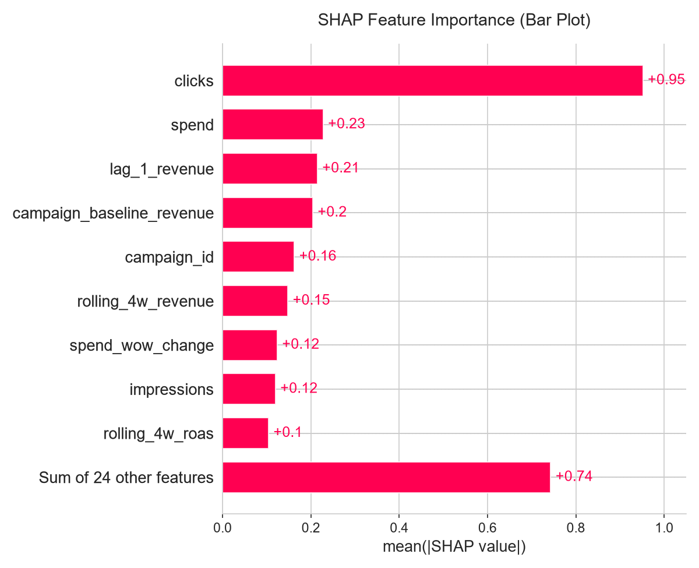
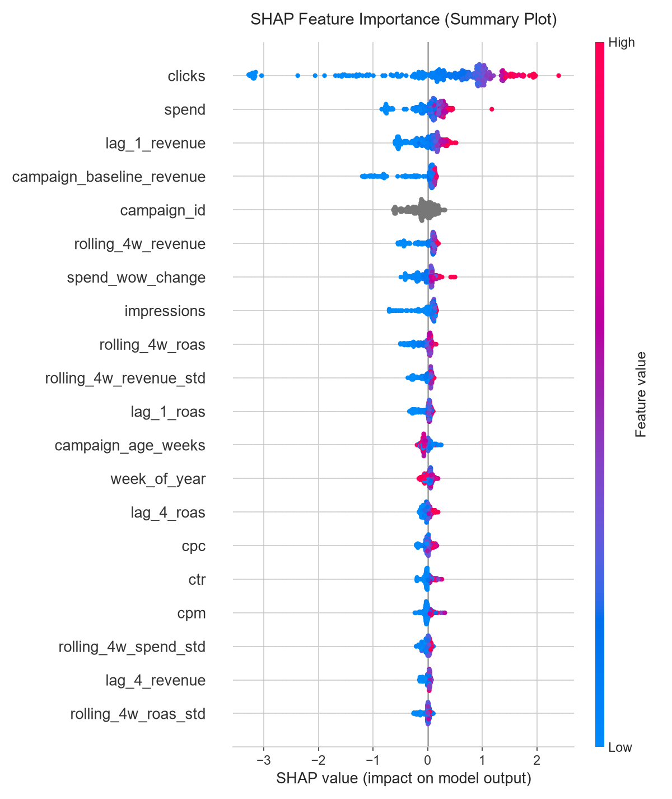
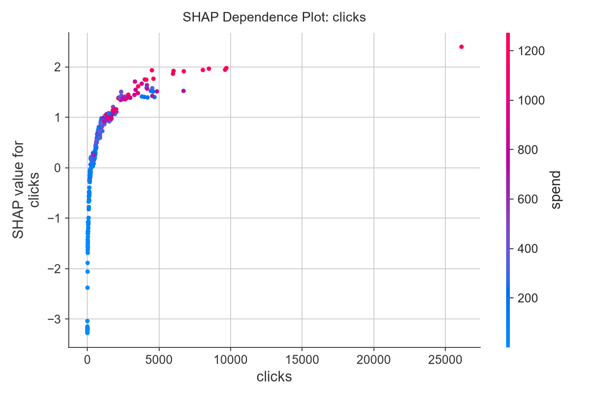
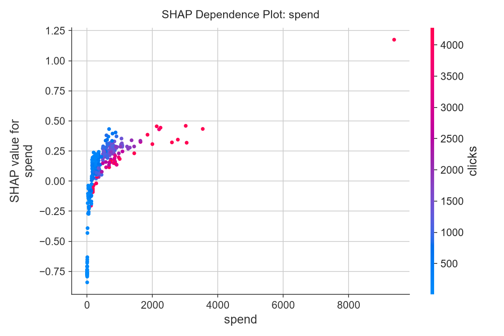
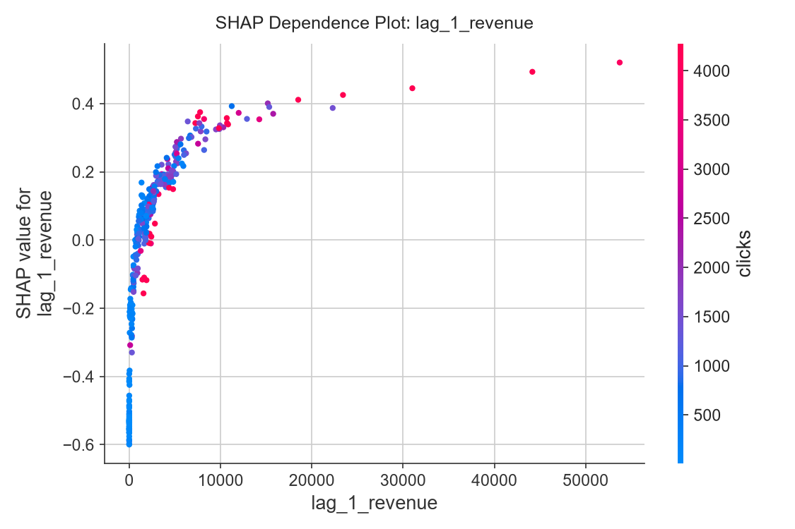

# Model Explainability: SHAP Interpretation Results

To understand how the Tuned Tweedie Model makes predictions, we ran SHAP (SHapley Additive exPlanations) on the 12-week unseen holdout dataset (334 samples). SHAP computes the marginal contribution of each feature to the final prediction.

Below are the generated explanation plots and their interpretations.

---

## 1. SHAP Bar Plot (Global Feature Importance)
The bar plot displays the mean absolute SHAP value for each feature, showing which features have the largest global impact on the forecasted revenue.

### Key Insights:
- **`clicks`** and **`spend`** are by far the two most important features in predicting weekly revenue.
- **`lag_1_revenue`** (revenue from the previous week) is the third most important feature, providing a strong baseline indicator of current performance.
- Engineered features such as **`campaign_baseline_revenue`** (expanding point-in-time historical mean) and **`rolling_4w_roas`** also play a significant role.

---

## 2. SHAP Summary Plot (Feature Directionality)
The summary plot combines feature importance with feature effects. Each dot represents a single campaign-week prediction. The position on the X-axis indicates the SHAP value (impact on output), and the color represents the feature value (red = high, blue = low).

### Key Insights:
- **`clicks` (Red on Right, Blue on Left):** High click counts strongly drive predictions upward, while low click counts push the predicted revenue downward.
- **`spend` (Red on Right):** Increased ad spend directly correlates with a positive SHAP value (higher predicted revenue).
- **`lag_1_revenue`:** High revenue in the prior week acts as a strong upward anchor for the current week's prediction.
- **`is_zero_spend` (Red on Left):** When ad spend is zero (red dot), the SHAP value is negative, pushing the predicted revenue to zero (which is correct behavior for paused campaigns).

---

## 3. SHAP Dependence Plots (Non-linear Interactions)
Dependence plots show the relationship between a single feature's value and its SHAP impact on the prediction. SHAP automatically colors dots based on the feature that interacts most strongly with the target feature.

### A. Dependence Plot: Clicks
This plot shows how the number of weekly clicks relates to its SHAP value, colored by its strongest interaction partner (`spend`).

### B. Dependence Plot: Spend
This plot shows the impact of spend, highlighting non-linear effects and how it interacts with `clicks`.

### C. Dependence Plot: Lag 1 Revenue
This plot shows the influence of the previous week's revenue, demonstrating how it scales and interacts with campaign baseline performance.

